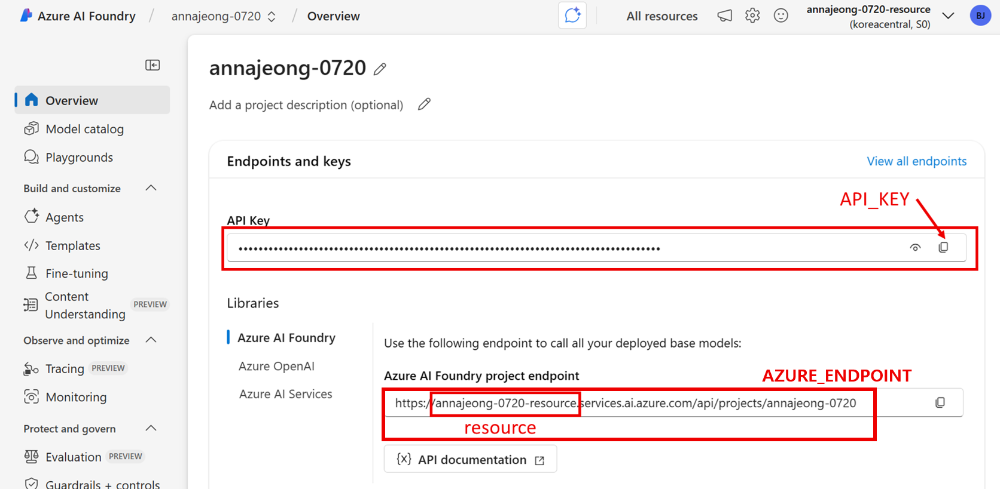

# 인증 정보 구성

1. VS Code 터미널에서 아래 명령어를 실행합니다.
    
    ```bash
    cp .env.example .env
    ```
    
2. [`Microsoft Foundry 포털`](https://ai.azure.com/)에 접속하여 생성한 프로젝트를 클릭한 뒤, 아래와 같이 `.env 파일`을 구성합니다.
    
    
    
    ```bash
    # Agent Service (AIProjectClient)용 Foundry Project endpoint
    PROJECT_ENDPOINT="https://<resource>.services.ai.azure.com/api/projects/<project_name>"

    # Chat/Embedding(Inference)용 models endpoint
    INFERENCE_ENDPOINT="https://<resource>.services.ai.azure.com/models"

    # Inference 호출용 키 (Chat/Embedding 노트북)
    INFERENCE_API_KEY="<inference-api-key>"

    # 선택: Agent Service를 Key 방식으로 실행할 때만 사용
    PROJECT_API_KEY="<project-api-key-optional>"
    ```
    
3. 왼쪽 메뉴에서 `모델 + 엔드포인트`를 클릭합니다.
4. 생성한 `LLM 모델`과 `임베딩 모델`을 `.env` 파일에 업데이트합니다.
    
    ```bash
    MODEL_NAME="gpt-4o"
    TEXT_EMBEDDING_MODEL="text-embedding-3-small"
    ```

5. 인증 방식 권장 규칙
   - Agent 노트북: Entra 인증(`DefaultAzureCredential`)을 기본 경로로 사용
   - Chat/Embedding 노트북: `INFERENCE_API_KEY` 기반 호출
   - `PROJECT_API_KEY`는 Agent를 Key 방식으로 실행해야 할 때만 옵션으로 사용
6. `.env` 파일을 적용합니다.
    ```
    source .env
    ```